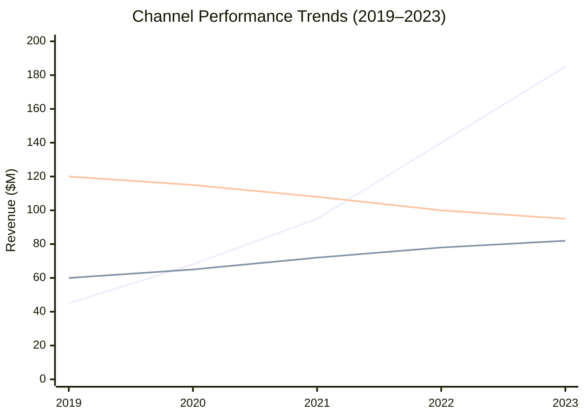

# Consulting Presentation Patterns

### A Visual Reference Guide

McKinsey / BCG / Bain Style Templates

---
layout: default
---

# Key findings indicate three strategic priorities to capture $35M incremental revenue

  
1

  

    
Expand into adjacent market segments to unlock $18M in untapped demand

    
Current penetration is only 12% in SMB segment vs. 45% in enterprise

  

  
2

  

    
Optimize pricing architecture to capture $10M through value-based tiers

    
Benchmarking shows 15-20% pricing gap vs. comparable solutions

  

  
3

  

    
Reduce churn by 3pp through dedicated customer success investment ($7M impact)

    
Top-quartile peers achieve 95% retention vs. our current 88%

  

EXECUTIVE SUMMARY

---
layout: section
---

# Strategic Growth Analysis

Revenue Drivers & Market Opportunity

---
layout: default
---

# Revenue grew from $100M to $135M, driven primarily by new products and geographic expansion

  

    

      

        $100M
      

      
FY22 Revenue

    

    

      

      

        +$20M
      

      
New Products

    

    

      

      

        +$15M
      

      
Geo Expansion

    

    

      

      

        +$8M
      

      
Price Increase

    

    

      

      

        −$8M
      

      
Lost Clients

    

    

      

        $135M
      

      
FY23 Revenue

    

  

  

Source: Company financials, FY22–FY23 actuals

---
layout: default
---

# Market composition shifted toward digital segments, now representing 45% of total

  

    

      100%75%50%25%0%
    

    

      

        
25%

        

        

        
35%

        
2020

      

      

        
30%

        

        

        
30%

        
2021

      

      

        
37%

        

        

        
25%

        
2022

      

      

        
45%

        

        

        
22%

        
2023

      

    

  

  

    <i class="leg seg-d-bg"></i> Digital
    <i class="leg seg-c-bg"></i> Services
    <i class="leg seg-b-bg"></i> Hybrid
    <i class="leg seg-a-bg"></i> Traditional
  

Source: Industry reports, market sizing analysis 2020–2023

---
layout: default
---

# Company A leads on revenue but lags in customer satisfaction vs. key competitors

  

    
Revenue ($M)

    
Company A
$850M

    
Company B
$720M

    
Company C
$580M

    
Company D
$410M

  

  

    
Customer Satisfaction (NPS)

    
Company A
52

    
Company B
71

    
Company C
68

    
Company D
78

  

Source: Public filings, proprietary NPS survey (n=2,400)

---
layout: default
---

# Digital adoption is accelerating while traditional channels plateau across all segments

Source: Internal channel reporting, FY19–FY23

---
layout: default
---

# Capability assessment reveals critical gaps in data analytics and AI/ML readiness

<table>
  <thead>
    <tr>
      <th>Capability</th>
      <th>Company A</th>
      <th>Company B</th>
      <th>Company C</th>
      <th>Best-in-Class</th>
    </tr>
  </thead>
  <tbody>
    <tr><td>Cloud Infrastructure</td><td class="ball">●</td><td class="ball">◕</td><td class="ball">◑</td><td class="ball">●</td></tr>
    <tr><td>Data Analytics</td><td class="ball warn">◔</td><td class="ball">◕</td><td class="ball">●</td><td class="ball">●</td></tr>
    <tr><td>AI / ML</td><td class="ball warn">○</td><td class="ball">◑</td><td class="ball">◕</td><td class="ball">●</td></tr>
    <tr><td>Cybersecurity</td><td class="ball">◕</td><td class="ball">●</td><td class="ball">◑</td><td class="ball">●</td></tr>
    <tr><td>DevOps Maturity</td><td class="ball">◑</td><td class="ball">◕</td><td class="ball">◕</td><td class="ball">●</td></tr>
    <tr><td>Customer Platform</td><td class="ball">●</td><td class="ball">◑</td><td class="ball">◔</td><td class="ball">●</td></tr>
  </tbody>
</table>

  ● Full ◕ Strong ◑ Moderate ◔ Weak ○ None

Source: Capability maturity assessment, Q3 2023

---
layout: default
---

# North America dominates market share but APAC is the fastest-growing region

  

    North America (40%)
    Europe (30%)
    APAC (20%)
    RoW
  

  

    

      
Company A 50%

      
Company B 30%

      
Others

    

    

      
Co. A 35%

      
Co. B 40%

      
Others

    

    

      

      

      
Local 55%

    

    

      

      

      

    

  

  

    <i style="background:#1B3A5C"></i> Company A
    <i style="background:#2E86AB"></i> Company B
    <i style="background:#E85D04"></i> Local Players
    <i style="background:#8B8B8B"></i> Others
  

Source: Gartner market share data, 2023

---
layout: section
---

# Strategic Frameworks

Analytical Tools & Decision Models

---
layout: default
---

# Initiatives should be prioritized based on impact potential and implementation effort

  
IMPACT →

  

    

      
Quick Wins

      
High Impact · Low Effort

      
Pricing optimization

      
Cross-sell program

    

    

      
Major Projects

      
High Impact · High Effort

      
Digital platform

    

    

      
Fill-ins

      
Low Impact · Low Effort

      
Process tweaks

    

    

      
Deprioritize

      
Low Impact · High Effort

      
Legacy migration

    

  

  
EFFORT →

---
layout: default
---

# The transformation follows five sequential phases from assessment through sustained optimization

  

    
01

    
Assess

    
Baseline & diagnostics

  

  

    
02

    
Design

    
Solution architecture

  

  

    
03

    
Pilot

    
Test & validate

  

  

    
04

    
Scale

    
Full rollout

  

  

    
05

    
Optimize

    
Continuous improvement

  

---
layout: default
---

# Organizational value is built on three foundational layers, each enabling the next

  

    

      

        <strong>Strategic Vision</strong>
        Market leadership & innovation
      

    

    

      

        <strong>Operational Excellence</strong>
        Scalable processes, talent & technology
      

    

    

      

        <strong>Foundation</strong>
        Culture, governance & core infrastructure
      

    

  

---
layout: default
---

# Implementation roadmap spans 18 months across three parallel workstreams

  

    
Technology

    

      
Platform selection

      
Build & integrate

      
Optimize & scale

    

  

  

    
Process

    

      
Map current state

      
Redesign

      
Roll out & monitor

    

  

  

    
People

    

      
Skills assessment

      
Training program

      
Change mgmt

    

  

  

    Q1 2024Q2 2024Q3 2024Q4 2024Q1 2025Q2 2025
  

  

    
▲ MVP

    
▲ Pilot Complete

    
▲ Full Deploy

  

Source: Program management office, preliminary timeline

---
layout: default
---

# Digital transformation will close performance gaps across five critical dimensions

<table>
  <thead>
    <tr>
      <th>Dimension</th>
      <th>Current State</th>
      <th></th>
      <th>Future State</th>
    </tr>
  </thead>
  <tbody>
    <tr>
      <td class="dim">Order Processing</td>
      <td class="current">Manual, 48hr cycle time</td>
      <td class="arrow">→</td>
      <td class="future">Automated, 4hr cycle time</td>
    </tr>
    <tr>
      <td class="dim">Data Analytics</td>
      <td class="current">Spreadsheet-based, monthly</td>
      <td class="arrow">→</td>
      <td class="future">Real-time dashboards, AI-driven</td>
    </tr>
    <tr>
      <td class="dim">Customer Experience</td>
      <td class="current">NPS 52, reactive support</td>
      <td class="arrow">→</td>
      <td class="future">NPS 75+, proactive engagement</td>
    </tr>
    <tr>
      <td class="dim">Supply Chain</td>
      <td class="current">3-week lead time, 85% OTIF</td>
      <td class="arrow">→</td>
      <td class="future">1-week lead time, 97% OTIF</td>
    </tr>
    <tr>
      <td class="dim">Cost Structure</td>
      <td class="current">SG&A at 28% of revenue</td>
      <td class="arrow">→</td>
      <td class="future">SG&A at 20% of revenue</td>
    </tr>
  </tbody>
</table>

---
layout: default
---

# Decision framework determines optimal market entry approach based on two key criteria

  
Market Attractiveness >$500M?

  

    

      
YES

      
Existing Capabilities?

      

        

          
YES

          
Organic Growth

        

        

          
NO

          
Acquire / Partner

        

      

    

    

      
NO

      
Strategic Fit?

      

        

          
YES

          
Monitor & Reassess

        

        

          
NO

          
Do Not Enter

        

      

    

  

---
layout: section
---

# Signature Elements

Callouts, Insights & Benchmark Patterns

---
layout: default
---

# Customer acquisition cost decreased 32% YoY, outpacing the industry benchmark of 18%

  

    
$127

    
Customer Acquisition Cost

    
▼ 32% vs. prior year

  

  

    
$187

    
Industry Average

  

  

    
3.2x

    
LTV/CAC Ratio

    
vs. 2.1x target

  

  

    
←

    
Driven by shift to digital channels and improved conversion funnel (12% → 18%)

  

  <strong>So what?</strong> The CAC improvement creates runway to invest $4M in growth while maintaining unit economics above target thresholds.

Source: Marketing analytics, FY23 actuals vs. FY22

---
layout: default
---

# Current performance trails best-in-class benchmarks, with largest gap in digital maturity

  

    
Revenue Growth

    

      
12%

      
8.5%

    

  

  

    
EBITDA Margin

    

      
28%

      
23%

    

  

  

    
Digital Revenue %

    

      
65%

      
32%

    

    
33pp gap

  

  

    
Customer NPS

    

      
78

      
52

    

  

  

    
Employee Engagement

    

      
82%

      
61%

    

  

  

    <i class="gl actual-l"></i> Current
    <i class="gl bench-l"></i> Best-in-class benchmark
  

  <strong>So what?</strong> The 33pp digital revenue gap represents the single largest value creation lever — closing half this gap would add ~$50M in annual revenue.

Source: McKinsey benchmarking database, peer group analysis 2023

---
layout: center
class: text-center
---

# Thank You

Consulting Presentation Patterns — A Visual Reference Guide

These templates are designed to be reused and adapted. 
Fork this repo and make them your own.

